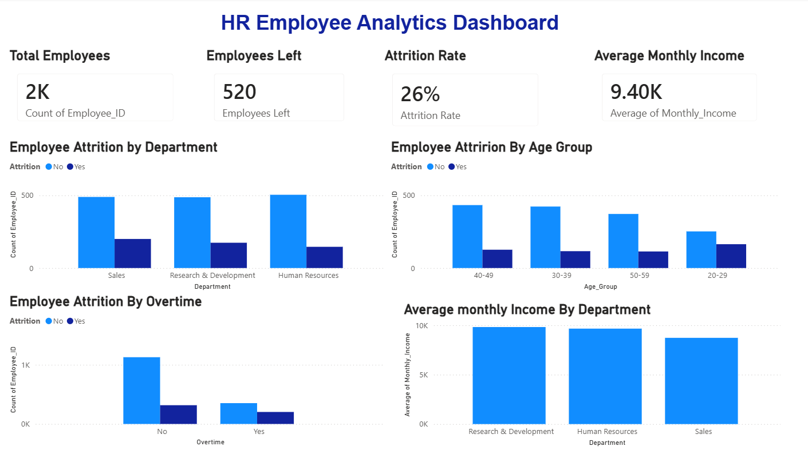

# HR Employee Analytics Dashboard

## Project Overview

An HR Employee Analytics project built using Python, SQL, Excel, and Power BI to analyze employee attrition, workforce trends, and salary patterns.

## Objectives

- Analyze employee attrition
- Identify department-wise attrition
- Analyze attrition by age group
- Analyze the impact of overtime on attrition
- Compare average monthly income across departments
- Build an interactive Power BI dashboard

## Tools & Technologies

- Python
- Pandas
- Matplotlib
- SQL
- SQLite
- Microsoft Excel
- Power BI

## Dataset

The dataset contains 2,000 employee records with information such as:

- Employee ID
- Age
- Gender
- Department
- Job Role
- Monthly Income
- Years at Company
- Job Satisfaction
- Performance Rating
- Overtime
- Education
- Marital Status
- Work-Life Balance

## Key Findings

- Total Employees: 2,000
- Employees Left: 520
- Attrition Rate: 26%
- Average Monthly Income: approximately 9,395
- Research & Development has the highest average monthly income.
- Employees working overtime show a higher level of attrition.

## Power BI Dashboard

The dashboard includes:

- Total Employees
- Employees Left
- Attrition Rate
- Average Monthly Income
- Employee Attrition by Department
- Employee Attrition by Age Group
- Employee Attrition by Overtime
- Average Monthly Income by Department

## Project Structure
67  ```text
68  HR-Employee-Analytics/
69  ├── data/
70  ├── python/
71  ├── reports/
72  ├── sql/
73  ├── HR Employee Analytics Dashboard.pbix
74  └── README.md
75  ```
76
77  ## Dashboard Preview
78
79  
